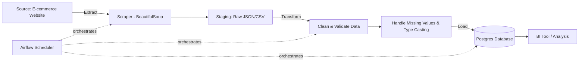

# Day 15 · Data Engineering Foundations & ETL Concepts

**🎯 Objective:** Understand what data engineering is and the ETL/ELT model.

## Role of a Data Engineer

A data engineer builds and maintains the systems that move data from where it's
generated to where it can be used — by analysts, ML models, or applications.
This covers the full data lifecycle: ingestion → storage → transformation → serving.

## ETL vs ELT

- **ETL (Extract, Transform, Load):** data is cleaned/transformed *before* loading
  into the destination. Common when the destination has limited compute, or when
  strict schema/quality rules must be enforced before storage.
- **ELT (Extract, Load, Transform):** raw data is loaded first, then transformed
  inside the destination (e.g., a data warehouse). Common with modern cloud
  warehouses (BigQuery, Snowflake) that have cheap, powerful compute.

## Batch vs Streaming

- **Batch:** data processed in scheduled chunks (e.g., hourly/daily). Simpler to
  build and debug; used when near-real-time isn't required.
- **Streaming:** data processed continuously, record by record, as it arrives
  (e.g., Kafka pipelines). Used when latency matters (fraud detection, live dashboards).

## Data Sources, Staging, Warehouses vs Lakes

- **Sources:** APIs, databases, files, scraped web data, event streams.
- **Staging area:** a temporary landing zone for raw data before transformation —
  keeps the raw copy safe in case transformation logic has bugs.
- **Data Warehouse:** stores structured, cleaned data optimized for queries/BI
  (e.g., PostgreSQL, Snowflake, BigQuery).
- **Data Lake:** stores raw/semi-structured data at scale, in native formats,
  often cheaper but requires more processing to query (e.g., S3 + Parquet).

## File Formats

- **CSV:** simple, human-readable, but no schema enforcement and slow for large data.
- **JSON:** flexible, nested structures, common for APIs, but verbose at scale.
- **Parquet:** columnar, compressed, schema-aware — much faster and cheaper for
  large-scale analytical workloads. Preferred format for data lakes.

## Idempotency, Schemas & Data Quality

- **Idempotency:** running a pipeline multiple times with the same input should
  produce the same result, not duplicate/corrupt data. Critical for pipelines
  that might retry after a failure.
- **Schemas:** defining expected structure/types up front catches bad data early
  rather than letting it silently break downstream.
- **Data quality basics:** checks like null rates, duplicate detection, and
  range/type validation should run as part of the pipeline, not as an afterthought.

## Hands-on: ETL Pipeline Architecture Sketch

Use case: scraping product data from an e-commerce site, cleaning it, and loading
it into a database for analysis (the same pattern used in my `ecommerce-etl-airflow-pipeline` project).

**Pipeline notes:**
- **Extract:** scraper pulls raw product data (price, stock, name) from the source site
- **Staging:** raw data is saved before transformation, so a bad transform doesn't destroy the original
- **Transform:** cleans prices/types, handles missing fields, validates against a schema
- **Load:** writes to Postgres using an idempotent upsert (rerunning won't create duplicates)
- **Orchestration:** Airflow schedules and retries each stage, with dependencies enforced
  between extract → transform → load