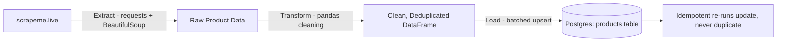

# Day 24 · Loading Scraped Data into DBs + Module 5 Review (Phase 1 Capstone)

**🎯 Objective:** Close the loop — scrape/ingest → transform → load to a real database.

## Pipeline Overview

## Why SQL (Postgres) for This Use Case

Product data here is structured and relational by nature (fixed fields: name, price,
URL), and the use case benefits from SQL's strong constraint enforcement — the
`UNIQUE` constraint on `name` is what makes the upsert logic possible at all.
NoSQL (Day 23's MongoDB) fits better for flexible, semi-structured, or rapidly
changing schemas; this dataset doesn't need that flexibility, so Postgres was chosen.

## Batching & Upserts

Records are loaded in batches of 100 rather than one giant insert, keeping memory
use predictable and isolating failures to a single batch. Each batch uses
`INSERT ... ON CONFLICT (name) DO UPDATE`, so re-running the pipeline updates
existing rows instead of duplicating them.

**Verified twice:** ran the pipeline back-to-back — both runs loaded 755 records,
and the final row count stayed at 755 both times. The `last_scraped_at` column
confirmed the second run's timestamp overwrote the first, proving rows were
genuinely updated, not skipped or duplicated.

## Connecting Back to Module 4

This reuses the same extract/transform structure built in Module 4 (Day 16's
scraper, Day 18's ETL pattern), now pointed at a real Postgres database instead
of SQLite — the same automation approach from Day 19 (Airflow scheduling) could
wrap this pipeline for production scheduling.

## Files
- `schema.sql` — products table with a unique constraint enabling upserts
- `pipeline.py` — full extract → transform → load pipeline with batching and logging